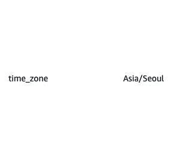

# AWS RDS, Ubuntu Timezone

## Problem

- Local환경에서의 타임존(Asia/Seoul)과 AWS RDS와 Ubuntu 서버의 타임존(UTC)이 달라 Database insert시 시간차가 발생하는 이슈

## AWS RDS MySQL

MySQL에서 해당 쿼리로 타임존을 검색해보면 아래와 같이 현재 타임존이 나온다.

```mysql
SELECT @@global.time_zone, @@session.time_zone;

[result]
@@global.time_zone -> SYSTEM
@@global.session.time_zone -> SYSTEM
```

해당 포스트에서 발생한 문제는 로컬환경과 다르게 System 타임존이 한국으로 설정이 되어있지 않아 발생한 문제였다.

아래의 쿼리로 타임존을 변경해준다.

```mysql
SET @@session.time_zone='+9:00';
```

MySQL Server를 재시작 했을 때에도 변경되지 않게 설정파일에 아래와 같이 타임존을 추가해준다.

```bash
[mysqld]
default-time-zone='+9:00'
```

추가로 RDS를 사용하는 경우 파라메터 그룹에 들어가 time_zone 셋팅을 Asia/Seoul로 변경해준다.


여기까지 설정을 하고 아래 쿼리를 실행시켜보면 현재 한국 시간이 나올 것이다.

```mysql
SELECT NOW();
```

## Ubuntu

날짜, 시간을 INSERT할 때 `moment`를 이용한 날짜입력을 할 때도 시간 설정이 정확히 되지 않은 문제가 발생했다.

아래의 명령어로 타임존을 Asia/Seoul로 변경해준다.

```bash
node
sudo timedatectl set-timezone 'Asia/Seoul'
date
```
