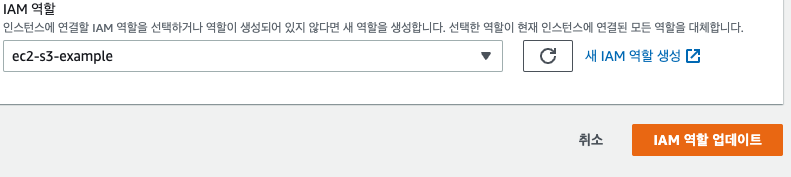

# Github Actions, AWS CodeDeploy를 이용해서 무중단 배포 적용하기 #1

> 기존에는 코드를 운영 환경에 배포시에 Git을 이용해서 적용했습니다.
> 하지만 코드가 변경 및 배포 주기가 짧아지면서 매번 운영서버에 접속해 코드를 받아주는 과정이 매우 비 효율적이며 귀찮습니다.

> 해당 글에서는 위 문제를 해결하기 위해 Github Actions, AWS CodeDeploy를 이용해서 AWS EC2에 배포를 자동화하는 과정과 Docker를 이용해 무중단 배포(Blue-Green)를 하는 과정을 정리해 보겠습니다.

> 만약 본문의 내용중 잘못된 내용이 있다면 피드백 부탁드리겠습니다.

- 예제로는 `Nest.js`를 이용하였으므로 다른 언어 및 프레임워크를 이용하거나 환경이 다를 경우 해당 게시글의 내용과 달라질 수 있습니다.
- 해당 게시글에서는 테스트 과정은 포함되어있지 않으니, 필요시에 코드를 테스트하는 과정을 추가하시면 좋습니다.

---

## 큰 동작 흐름

1. 코드를 Github의 `master` 또는 `main` 브랜치에 push 또는 pull request한다.
2. 1번의 이벤트가 발생했을 때 Github Actions로 코드를 빌드하고 AWS S3 Upload 및 AWS CodeDeploy를 통한 배포를 한다. (해당 과정에서 오류가 있거나, 테스트를 실패 하였을 시 배포가 되지 않습니다.)
3. 미리 등록한 배포 스크립트를 실행하여 Docker로 배포한다.
4. 3번 과정에서 이미 실행중인 Docker Container가 있다면 Docker Compose를 이용해서 Blue Green 배포를 한다.
5. Nginx를 이용해 로드밸런서 및 SSL을 적용한다.

이번 글에서는 2번 과정까지 진행해보겠습니다.

---

## Github Actions workflows 작성하기


배포할 코드가 있는 Github Repository에 가서 Actions - `set up a workflow yourself`를 눌러줍니다.
그리고 해당 파일에 아래와 같이 작성하여 `master`브랜치에 push 또는 pull request 이벤트가 발생하였을 때 Github Actions workflow가 잘 동작하는지 확인해봅니다.

```bash
name: Code Deploy

on:
  push:
    branches:
      - master
  pull_request:
    branches:
      - master

jobs:
  build:
    runs-on: ubuntu-20.04
      - name: Checkout source code
        uses: actions/checkout@master

      - name: Setup Node.js environment
        uses: actions/setup-node@v3.4.1
        with:
          node-version: 17.8.0

      - name: Cache node modules
        uses: actions/cache@v1
        with:
          path: node_modules
          key: ${{ runner.OS }}-master-build-${{ hashFiles('**/package-lock.lock') }}
          restore-keys: |
            ${{ runner.OS }}-build-
            ${{ runner.OS }}-

      - name: Install Dependencies
        run: npm install

      - name: Build Project
          run: npm run build
```


프로젝트 빌드까지 잘 되는 것을 확인 했습니다.

이제 빌드된 프로젝트를 AWS S3에 업로드 및 EC2 Instance에 Code Deploy를 하기 위해 AWS IAM 사용자 및 역할을 만들어주겠습니다.

### AWS IAM 사용자 추가

먼저 IAM에 접속 후 사용자 추가를 아래와 같이 해주세요.
권한에는 AWSCodeDeployFullAccess, AmazonS3FullAccess 추가를 해주셔야합니다.


사용자를 만들면 꼭 csv파일을 다운로드 받아서 잘 보관해주세요.

### AWS IAM 역할 추가

CodeDeploy가 EC2에 대한 접근 권한이 필요하기 때문에 해당 역할을 만들어줍니다.


다음은 S3에 올라가있는 코드를 다운받기 위한 S3 접근 권한이 필요하기 떄문에 해당 열할을 만들어줍니다.


### AWS S3 버킷 생성하기

Github Actions에서 빌드가 완료된 코드를 업로드 하기 위한 S3 버킷을 만들어줍니다.


### AWS EC2 인스턴스 생성하기

EC2 Instance를 생성해줍니다.
서비스에 맞게 Instance및 설정을 셋팅해주시면 되며, 예제에서는

- 애플리케이션 및 OS 이미지 : Ubuntu 20.04 LTS (HVM)
- 인스턴스 유형 : t2.micro
- 스토리지 : 30 GiB
- 보안그룹 : 22, 80, 443, 3001, 3002 Open

설정으로 셋팅하였습니다.

Instance 생성을 완료했으면 아까 만들어둔 IAM 역할을 연결해줍니다.




### CodeDeploy 생성

아래와 같이 CodeDeploy 애플리케이션을 생성해줍니다.


생성이 완료되었다면 배포그룹을 생성해줍니다.


배포그룹의 서비스 역할에는 아까 만들어둔 code deploy 역할을 선택해주시면됩니다.


EC2 인스턴스는 아까 만들어둔 EC2 Instance를 선택합니다.


## EC2 Instance에 CodeDeploy Agent 설치하기

EC2 Instance에서 Deploy를 감지하기 위해서 CodeDeploy를 필요로 합니다.

아래와 같이 설치하며, 해당 과정은 Ubuntu 20.04 기준으로 작성되었으며, 현재 파악된 문문제로는 Ubuntu 22.04에서 진행 시 CodeDeploy Agent를 설치하기 위해서는 Ruby가 필요한데, 22.04에서 설치되는 Ruby 버전이 호환이 안되어 install이 안되는 문제가 있습니다.
해당 버전에서의 문제는 아래 링크를 참고해주세요.

Ubuntu 22.04 CodeDeploy agent is not supporting ruby v3.0.1 : [https://github.com/aws/aws-codedeploy-agent/issues/301](https://github.com/aws/aws-codedeploy-agent/issues/301)

```bash
sudo apt-get update
sudo apt-get install awscli
sudo aws configure
```

`sudo aws configure` 명령어를 입력하면 아래와같이 정보를 입력하게 나오는데 아까 다운로드 받은 CSV 파일에 있는 값들을 넣어주면 됩니다.


값을 넣어주었다면, 아래 명령어로 CodeDeploy Agent를 설치합니다.

```bash
sudo apt update
sudo apt install ruby-full
sudo apt install wget
cd /home/ubuntu
wget https://aws-codedeploy-ap-northeast-2.s3.ap-northeast-2.amazonaws.com/latest/install
chmod +x ./install
sudo ./install auto > /tmp/logfile
sudo service codedeploy-agent status
```

status를 조회했을 때 active (running) 상태면 정상적으로 설치가 된 것 입니다.

배포할 코드를 담아둘 deploy 폴더를 만듭니다. 폴더명 및 경로는 변경해도 상관없습니다.

```bash
cd /home/ubuntu
mkdir deploy
```

### Github Actions workflow 수정 및 Secret 등록

이제 AWS S3에 코드를 업로드 하고 EC2까지 전달이 되는지 테스트를 하기 위해 workflow 수정 및 Secret을 등록해보겠습니다.

Workflow를 아래와 같이 수정해 주세요. (환경, 언어 등이 다른 경우 환경에 맞게 workflow를 수정해주세요.)

```bash
name: Code Deploy

on:
  push:
    branches:
      - master
  pull_request:
    branches:
      - master

jobs:
  build:
    runs-on: ubuntu-20.04
    env:
      IMAGE_TAG: ${{ github.sha }} # 파일명을 중복되지 않게 생성하기 위한 변수.
    steps:
      - name: Checkout source code
        uses: actions/checkout@master

      - name: Setup Node.js environment
        uses: actions/setup-node@v3.4.1
        with:
          node-version: 17.8.0

      - name: Cache node modules
        uses: actions/cache@v1
        with:
          path: node_modules
          key: ${{ runner.OS }}-master-build-${{ hashFiles('**/package-lock.lock') }}
          restore-keys: |
            ${{ runner.OS }}-build-
            ${{ runner.OS }}-

      - name: Install Dependencies
        run: npm install --save-dev --force

      # 만약 운영 환경에서 사용할 .env 파일이 필요하다면 아래와 같이 넣어주세요.
      # .env에 들어갈 내용은 Github Repository의 Secrets - Actions에 들어가 있어야 합니다.
      - name: Create Env File
        run: |
          touch .env.prod
          echo EXAMPLE=${{ secrets.EXAMPLE }} >> .env.prod
          cat .env.prod

      - name: Build Project
        run: npm run build

      - name: AWS Configure
        uses: aws-actions/configure-aws-credentials@v1
        with:
          aws-access-key-id: ${{ secrets.AWS_S3_DEPLOY_ACCESS_KEY }}
          aws-secret-access-key: ${{ secrets.AWS_S3_DEPLOY_SECRET_ACCESS_KEY }}
          aws-region: ap-northeast-2

      - name: AWS S3 Upload
        run: aws deploy push --application-name your-code-deploy-application-name --description "deploy example" --s3-location s3://your-s3-bucket-name/deploy_$IMAGE_TAG.zip --source .

      - name: Code Deploy
        run: aws deploy create-deployment --application-name your-code-deploy-application-name --deployment-config-name CodeDeployDefault.OneAtATime --deployment-group-name your-code-deploy-group-name --s3-location bucket=your-s3-bucket-name,bundleType=zip,key=deploy_$IMAGE_TAG.zip

```

위와같이 수정을 하면 2가지의 에러가 발생합니다.

먼저, Workflow가 아까 만들어둔 S3와 CodeDeploy에 접근하기 위한 `AWS Configure`부분의 `aws-access-key-id`와 `aws-secret-access-key`를 등록하지 않았기에 이 부분에서 에러가 발생합니다.
이 부분을 해결하기 위해 Github Repository > Settings -> Secrets -> Actions로 이동해 해당 부분을 등록해줍니다.


등록을 완료 후 다시 Workflow를 동작시키면 두번째 에러가 발생합니다.
바로 `appspec.yml was not found` appspec.yml이 없다고 나오는데, 해당 파일은 CodeDeploy가 어떻게 행동할 것인지를 판단할 떄 사용됩니다.

appspec.yml을 아래와 같이 작성해주고, 프로젝트 루트 경로에 저장합니다.

```bash
  version: 0.0
  os: linux
  files:
    - source: /
      destination: /home/ubuntu/deploy
      overwrite: yes

  permissions:
    - object: /
      pattern: '**'
      owner: ubuntu
      group: ubuntu

  hooks:
    AfterInstall:
      - location: scripts/execute.sh
        timeout: 600
        runas: ubuntu
```

그리고, AfterInstall 이벤트가 발생할 때 실행될 스크립트(`scripts/execute.sh`)를 임시로 정의해 줍니다.

```bash
  #!/bin/bash

  cd /home/ubuntu/deploy
```

이제 appspec.yml과 execute.sh를 commit, push 해봅시다.

먼저 `master` 브랜치에 push 이벤트가 발생하였으므로 Github Actions에서 위에서 작성한 Workflow가 실행된 것을 볼 수 있고, S3 Upload 및 Code Deploy모두 성공적으로 동작한 것을 볼 수 있습니다.


다음으로 S3에 빌드된 zip이 있는지 확인해 봅시다.


정상적으로 S3에 업로드 된 것이 확인이 됩니다.

다음으로 CodeDeploy 배포 과정중에 문제가 없는지 확인해봅니다.


모든 이벤트가 성공적으로 동작이 된 것이 확인이 됩니다.
만약 CodeDeploy 이벤트에서 에러가 발생하면 로그 파악 후 수정을 해주어야 합니다.

마지막으로 EC2 Instance에 deploy가 잘 되었는지 확인해봅니다.


EC2에도 정상적으로 deploy된 파일들이 있는 것이 확인이 되었습니다.

---

이번 글에서는 Github Actions를 이용해서 S3에 코드를 업로드 하고, CodeDeploy를 통해서 최종적으로 EC2 Instance에 deploy하는 과정까지 작성해 보았습니다.

다음 게시글에서는 CodeDeploy의 AfterInstall 이벤트가 발생할 때 Docker를 이용하여 blue green 배포를 하는 방법을 작성 해 보겠습니다.
