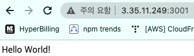

# Github Actions, AWS CodeDeploy를 이용해서 무중단 배포 적용하기 #2

> 기존에는 코드를 운영 환경에 배포시에 Git을 이용해서 적용했습니다.
> 하지만 코드가 변경 및 배포 주기가 짧아지면서 매번 운영서버에 접속해 코드를 받아주는 과정이 매우 비 효율적이며 귀찮습니다.

> 해당 글에서는 위 문제를 해결하기 위해 Github Actions, AWS CodeDeploy를 이용해서 AWS EC2에 배포를 자동화하는 과정과 Docker를 이용해 무중단 배포(Blue-Green)를 하는 과정을 정리해 보겠습니다.

> 만약 본문의 내용중 잘못된 내용이 있다면 피드백 부탁드리겠습니다.

- 예제로는 `Nest.js`를 이용하였으므로 다른 언어 및 프레임워크를 이용하거나 환경이 다를 경우 해당 게시글의 내용과 달라질 수 있습니다.
- 해당 게시글에서는 테스트 과정은 포함되어있지 않으니, 필요시에 코드를 테스트하는 과정을 추가하시면 좋습니다.

---

## 큰 동작 흐름

1. 코드를 Github의 `master` 또는 `main` 브랜치에 push 또는 pull request한다.
2. 1번의 이벤트가 발생했을 때 Github Actions로 코드를 빌드하고 AWS S3 Upload 및 AWS CodeDeploy를 통한 배포를 한다. (해당 과정에서 오류가 있거나, 테스트를 실패 하였을 시 배포가 되지 않습니다.)
3. 미리 등록한 배포 스크립트를 실행하여 Docker로 배포한다.
4. 3번 과정에서 이미 실행중인 Docker Container가 있다면 Docker Compose를 이용해서 Blue Green 배포를 한다.
5. Nginx를 이용해 로드밸런서 및 SSL을 적용한다.

이번 글에서는 3~4번 과정을 진행해보겠습니다.

---

## Docker 설치하기

```bash
sudo apt-get update
sudo apt-get install apt-transport-https ca-certificates curl software-properties-common
curl -fsSL https://download.docker.com/linux/ubuntu/gpg | sudo apt-key add -
sudo add-apt-repository "deb [arch=amd64] https://download.docker.com/linux/ubuntu focal stable"
sudo apt-get update
sudo apt-get install docker-ce
sudo systemctl status docker
sudo usermod -aG docker ${USER}
docker # 확인
```

## docker-compose 설치하기

```bash
sudo curl -L "https://github.com/docker/compose/releases/download/v2.9.0/docker-compose-$(uname -s)-$(uname -m)" -o /usr/local/bin/docker-compose # 2022년 08월 19일 기준 최신 버전 v2.9.0
sudo chmod +x /usr/local/bin/docker-compose
docker-compose -v
```

## Dockerfile 작성하기

```bash
FROM node:alpine

WORKDIR /usr/src/app

COPY package*.json ./

RUN npm ci --only=production

COPY . .

EXPOSE 3000

CMD ["npm", "run", "start:prod"]
```

## 무중단 배포(Blue Green)를 위한 docker-compose 작성하기

`docker-compose.green.yml`

```bash
version: '3'

services:
  app:
    build: .
    container_name: app-green
    restart: always
    ports:
      - '3001:3000'
```

`docker-compose.blue.yml`

```bash
version: '3'

services:
  app:
    build: .
    container_name: app-blue
    restart: always
    ports:
      - '3002:3000'
```

## Deploy Script 작성

`scripts/switch-container.sh`를 아래와 같이 작성합니다.

```bash
#!/bin/bash

DOCKER_APP_NAME=app
EXIST_GREEN=$(docker-compose -p ${DOCKER_APP_NAME}-green -f docker-compose.green.yml ps | grep running)

TARGET_PORT=0

TARGET_COLOR=""

if [ -z "$EXIST_GREEN" ]; then
    echo "> Start Green Container..."
    TARGET_PORT=3001
    TARGET_COLOR="blue"
    docker-compose -p ${DOCKER_APP_NAME}-green -f docker-compose.green.yml up -d
else
    echo "> Start Blue Container..."
    TARGET_PORT=3002
    TARGET_COLOR="green"
    docker-compose -p ${DOCKER_APP_NAME}-blue -f docker-compose.blue.yml up -d
fi

echo "> Start health check of Server at 'http://127.0.0.1:${TARGET_PORT}/health-check-api-endpoint'..."

for RETRY_COUNT in `seq 1 10`
do
    echo "> Retrying... (${RETRY_COUNT})"

    RESPONSE_CODE=$(curl -s -o /dev/null -w "%{http_code}" http://127.0.0.1:${TARGET_PORT}/health-check-api-endpoint)

    if [ ${RESPONSE_CODE} -eq 200 ]; then
        echo "> New Server successfully running"
        echo "> Close Old Server"
        docker-compose -p ${DOCKER_APP_NAME}-${TARGET_COLOR} -f docker-compose.${TARGET_COLOR}.yml down
        break

    elif [ ${RETRY_COUNT} -eq 10 ]; then
        echo "> Health check failed."
        exit 1
    fi
    sleep 10
done


echo "Prune Docker System"
docker system prune -af

exit 0
```

기존 `scripts/execute.sh`을 아래와 같이 수정합니다.

```bash
#!/bin/bash

cd /home/ubuntu/deploy
sh scripts/switch-container.sh
```

작성이 전부 완료되었다면 `push`를 해서 Github Actions가 새로운 스크립트를 잘 작동시키는지와 EC2 Instance에 docker container 배포가 잘 되었는지 확인해봅니다.

```bash
sudo docker ps # 도커 컨테이너 확인
```

<kbd>
  
</kbd>

첫 실행이니 green 배포가 완료되었습니다.
서버의 3001번 포트로 접속을해서 배포가 되었는지 확인해봅니다.

<kbd>
  
</kbd>

3001번 포트로 배포가 된 것을 확인해 볼 수 있습니다.

이 부분에서 container가 정상적으로 배포가 되었지만, 3001번 포트로 접근이 안되는 경우 보안 그룹에서 3001번 포트가 열려있지 않기 때문일 가능성이 큽니다.

이제 api를 간단히 하나 추가하고, blue 배포가 되는지 확인해봅니다.

`app.controller.ts`

```javascript
@Get()
getHelloBlueDeploy('/blue'): string {
  return 'Hello blue deploy';
}
```

이제 3001번 포트로 배포된 green container가 종료되고 3002번 포트로 blue container가 배포가 잘 되었는지 확인해봅시다.

<kbd>
  
</kbd>

green container가 종료되고 blue 배포가 완료되었습니다.
서버의 3002번 포트로 접속을해서 배포가 잘 되었는지 확인해봅니다.

<kbd>
  
</kbd>

3002번 포트로 배포가 된 것을 확인해 볼 수 있습니다.

---

이번 글에서는 Docker를 이용한 blue green 배포를 해보았습니다.
다음 게시글에서는 Nginx를 이용해서 로드벨런서를 적용하고 추가로 SSL까지 적용해보는 법을 작성해보겠습니다.
