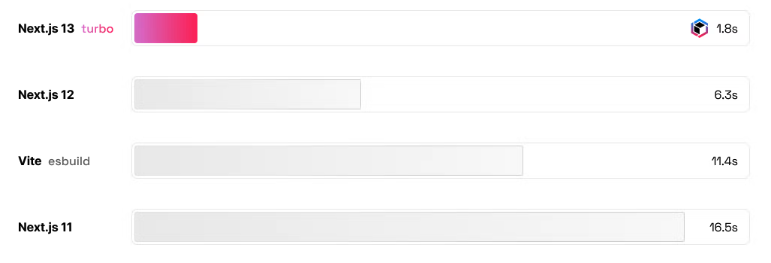

# Next.js 13 정리 및 요약

이번 2022.10.26 진행한 Next.js Conf에서 Next.js 13을 공개했습니다.
공식문서와 Conf 내용을 바탕으로 Next.js 13에서 변경된 점을 정리해보겠습니다.

---

## app 디렉토리

기존 Next.js 12 버전은 `/pages` 디렉토리에 폴더에서 개발을 했습니다.
```bash
pages
│
├── _app.js
├── index.js
├── ...

```

Next.js 13 버전부터는 `/app` 디렉토리에서 개발을 합니다.
```bash
pages
│
├── layout.js
├── page.js
├── ...

```

app 디렉토리를 사용하기 위해서는 `next.config.js` 파일에 아래와같이 설정을 추가해주셔야합니다.
```javascript
const nextConfig = {
  ...
  experimental: {
    appDir: true
  }
  ...
}
...
```


### Layout

Next.js 13 버전부터는 layout이 도입되었습니다.
기존에는 아래와 같이 Layout 컴포넌트를 만들어서 사용을 많이 했습니다.

```javascript
// components/layout.tsx

interface LayoutProps {
  children: React.ReactNode;
}

export default function Layout({ children }: LayoutProps) {
  return (
    <div>
      <header>header</header>
      {children}
    </div>
  )
}
```
```javascript
// pages/index.tsx

import Layout from '@components/layout';

export default function MainPage() {
  return (
    <Layout>
      <h1>Next js 12</h1>
    </Layout>
  )
}
```

13 버전부터는 layout을 이용해 개발을 하면 됩니다.
```javascript
// app/page.tsx

export default function Page() {
  return (
    <div>
      <h1>Next js 13</h1>
    </div>
  )
}
```
```javascript
// app/layout.tsx

interface RootLayout {
  children: React.ReactNode;
}

export default function RootLayout({ children }: RootLayout) {
  return (
    <div>
      <header>header</header>
      <h1>{children}</h1>
    </div>
  )
}
```

---

## Data Fetcing

기존에는 SSR을 아래와 같이 사용했습니다.
```javascript
interface PageProps {
  result: {
    id: number;
    userId: number;
    title: string;
    completed: boolean;
  };
}

export default function Page({ result }: PageProps) {
  return (
    <div>
      <h1>{result.id}</h1>
    </div>
  )
}

export async function getServerSideProps() {
  const response = await fetch('https://jsonplaceholder.typicode.com/todos/1');
  const result = await response.json();
  return {
    props: { result }
  }
}
```

Next.js 13 버전은 아래와 같이 변경되었습니다.
```javascript
interface GetDataOutput {
  id: number;
  userId: number;
  title: string;
  completed: boolean;
}

export default async function Page() {
  const result = await getData();

  return (
    <div>
      <h1>{result.id}</h1>
    </div>
  )
}

async function getData(): Promise<GetDataOutput> {
  const response = await fetch('https://jsonplaceholder.typicode.com/todos/1');
  const result = await response.json();

  return result;
}
```

fetch Web API를 사용할 때 `getStaticProps`, `getServerSideProps`와 유사하게 동작을 시키려면 아래를 참고하면 됩니다. (참조 : Next.js - next 13 공식문서)

```javascript
// This request should be cached until manually invalidated.
// Similar to `getStaticProps`.
// `force-cache` is the default and can be omitted.
fetch(URL, { cache: 'force-cache' });

// This request should be refetched on every request.
// Similar to `getServerSideProps`.
fetch(URL, { cache: 'no-store' });

// This request should be cached with a lifetime of 10 seconds.
// Similar to `getStaticProps` with the `revalidate` option.
fetch(URL, { next: { revalidate: 10 } });
```

---

## Link

기존에는 `Link`컴포넌트를 사용할 때 `a`태그를 자식으로 넣어야 했었습니다.
하지만 13버전 부터는 `a`태그를 자식으로 넣을 필요가 없어졌습니다.

```javascript
import Link from 'next/link'

// Next.js 12
<Link href="/login">
  <a>login</a>
</Link>

// Next.js 13
<Link href="/login">
  login
</Link>
```

---

## Font

기존에 폰트를 불러올 때 레이아웃 시프트 현상이 발생했었는데, CSS `size-adjust`속성을 사용해서 해결했다고 합니다.
추가적으로, 글꼴 자동 최적화, 외부 네트워크 제거 등의 성능 향상이 되었습니다.

---

## Image

이미지 컴포넌트도 접근성 향상 및 성능 향상이 되었습니다.

---

## Turbopack

Rust로 만든 Javascript 번들링도구입니다.
속도가 많이 빨라졌다고 합니다.

<kbd>

</kbd>

---

이외에도

React.js 버전 17.0.2 -> 18.2.0 증가
Node.js 버전 12.22.0 -> 14.6.0 증가
인터넷 익스플로러 지원 종료 등

여러 변경사항이 추가되었습니다.

상세한 내용은 아래 Next.js 13 문서를 참고하여 주시길 바라겠습니다.
https://nextjs.org/blog/next-13