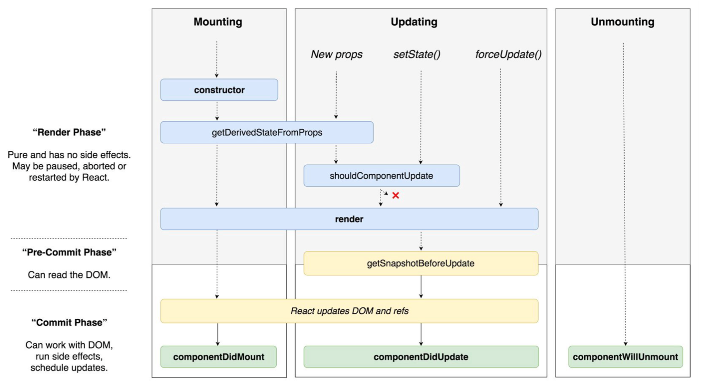

# React LifeCycle

> 리액트는 UI가 변경되면 자동으로 컴포넌트가 업데이트되며 동적으로 화면을 변경해줍니다.  
리액트의 컴포넌트는 컴포넌트가 생성, 업데이트, 제거될 때 까지의 생명주기를 가집니다.  
React의 LifeCycle을 정리해보겠습니다.


Source : [https://github.com/wojtekmaj/react-lifecycle-methods-diagram](https://github.com/wojtekmaj/react-lifecycle-methods-diagram)

---

## Mounting (생성)

최초에 컴포넌트가 생성될 때 한 번 수행됩니다.  
컴포넌트가 브라우저에 나타나기전과 나타난 후에 호출되는 API입니다.

### constructor

```javascript
constructor(props) {
  super(props);
}
```

컴포넌트가 생성될 때 한번만 실행되며, 가장 먼저 실행되는 메서드입니다.  
생성자 메서드입니다.  
초기 `state`를 설정합니다.  
`props`는 상위 컴포넌트에서 전달해주는 값이 들어있습니다.

### getDerivedStateFromProps

```javascript
static getDerivedStateFromProps(props, state) {
  if (props.name !== state.name) {
    return { name: props.name };
  }
  return null;
}
```

컴포넌트가 처음 생성될 때, 컴포넌트가 리렌더링 되기 전에 실행됩니다. (`render`메서드를 호출하기 직전)  
`props`로 받아온 정보를 state에 넣어줄 때 사용합니다.  
다른 라이프라이클 메서드와 다르게 앞에 `static`을 붙여야하며 정적 메서드이기 떄문에 `this`를 조회 할 수 없습니다.  
전달받은 인수에 props와 현재 state가 있으므로 this대신 사용합니다.  
return 값이 있으면 state를 변경하지만 return null일 경우 아무것도 하지 않습니다.

리액트 공식문서에는 이 메서드에 대해 아래와 같이 설명합니다.
> 시간이 흐름에 따라 변하는 props에 state가 의존하는 아주 드문 사용례를 위하여 존재합니다.  
state를 끌어오면 코드가 장황해지고, 이로 인하여 컴포넌트를 이해하기 어려워집니다.  
보다 간단한 다른 대안들에 익숙해지는 것을 권장합니다.

- props 변화에 대응한 부수 효과를 발생시켜야 한다면 (예를 들어, 데이터 가져오기 또는 애니메이션), componentDidUpdate 생명주기를 대신해서 사용하세요.
- props가 변화했을 때에만 일부 데이터를 다시 계산 하고 싶다면, Memoization Helper를 대신해서 사용하세요.
- props가 변화할 때에 일부 state를 재설정 하고 싶다면, 완전 제어 컴포넌트 또는 key를 사용하는 완전 비제어 컴포넌트로 만들어서 사용하세요.

__이전 속성값과 이후 속성값에 의존적인 상태값이 필요한 경우에만 사용을 하기 때문에 사용할 경우가 드뭅니다.__

### render

```javascript
render()
```

컴포넌트를 렌더링하는 메서드입니다.  
`render`함수 내부에서 `setState`를 호출하면 안됩니다.  
사이드이펙트를 발생시키면 안됩니다.  
비동시 통신, 쿠키사용등은 다른 생명주기 메서드에서 사용해야하며 렌더링만 해야합니다.

#### componentDidMount

```javascript
componentDidMount()
```

컴포넌트의 첫 렌더링이 끝나면 호출됩니다.  
이 메서드가 호출되었을 경우엔 컴포넌트가 화면에 그려진 상태입니다.  
이 메서드에서 비동기 통신과 돔을 사용해야하는 외부 라이브러리를 연동합니다.

---

## Updating (업데이트)

컴포넌트가 업데이트가 될 때 수행됩니다.

### getDerivedStateFromProps

앞에서 다룬 내용을 참고해주시면 됩니다.  
컴포넌트의 `props`, `state`가 변경될 때도 이 메서드가 호출됩니다.

### shouldComponentUpdate

```javascript
shouldComponentUpdate(nextProps, nextState)
```

이 메서드는 컴포넌트가 리렌더링을 할 것인지를 정할 수 있는 메서드입니다.  
주로 성능 최적화를 위해 사용합니다.  
return되는 타입은 `booloean`이며, `true`를 return하면 `render`메소드가 호출되고, `false`를 return하면 업데이트가 되지 않습니다.

```javascript
class TestComponent extends React.Component {
  shouldComponentUpdate(nextProps, nextState) {
    const { age } = this.state;
    return age !== nextProps.age; // 나이가 바뀔때만 업데이트한다.
  }
}
```

### render

앞에서 다른 내용을 참고해주시면 됩니다.  
컴포넌트를 렌더링하는 메서드입니다.

### getSnapshotBeforeUpdate

```javascript
getSnapshotBeforeUpdate(prevProps, prevState)
```

이 메서드는 리렌더링의 결과가 실제 DOM에 반영되기 직전에 호출됩니다.  
메서드 이름처럼 컴포넌트가 업데이트 되기 직전에 snapshot을 확보하기 위함입니다.
이 다음에 실행되는 `componentDidUpdate`의 세번째 인자로 들어갑니다.  
이전속성, 이전상태, 스냅샷을 이용해서 DOM의 상태변화를 체크할 수 있습니다.

### componentDidUpdate

```javascript
componentDidUpdate(prevProps, prevState, snapShot) {
  if (snapShot) {

  }
}
```

이 메서드는 리렌더링이 종료되고, 화면에 우리가 원하는 변화가 반영되고 난 뒤 호출됩니다.  
그리고 3번째 파라미터로 `getSnapshotBeforeUpdate`에서 return한 값을 조회할 수 있습니다.

---

## Unmounting (제거)

컴포넌트가 화면에서 사라질 때 수행됩니다.

### componentWillUnmount

```javascript
componentWillUnmount()
```

이 메서드는 컴포넌트가 화면에서 사라지기 직전에 호출됩니다.  
여기서는 DOM에 직접 등록한 이벤트들을 제거하고, `setTimeout`을 `clearTimeout`으로 제거합니다.

---

## Exception handling (에러처리)

리액트에서 발행하는 에러를 처리하기위해 사용됩니다.

### getDerivedStateFromError

```javascript
static getDerivedStateFromError(error)
```

이 메서드는 에러정보를 state에 저장한 뒤 화면에 나타낼 때 사용합니다.  
render 단계에서 호출되므로, 사이드이펙트를 발생시키면 안됩니다.
따라서 이 메서드에서는 서버로 에러전송은 하지 않으며, 서버로 에러전송은 `componentDidCatch`에서 합니다.

### componentDidCatch

```javascript
componentDidCatch(error, info)
```

이 메서드는 에러정보를 서버에 전송할 때 사용합니다.  
`info` 매개변수에는 어떤 컴포넌트가 오류를 발생시켰는지에 대한 정보를 포함한 componentStack 키를 갖고 있는 객체를 가지고 있습니다.  
commit 단계에서 호출되므로, 서버로의 에러로그 전송을 해보 문제가 없습니다.
